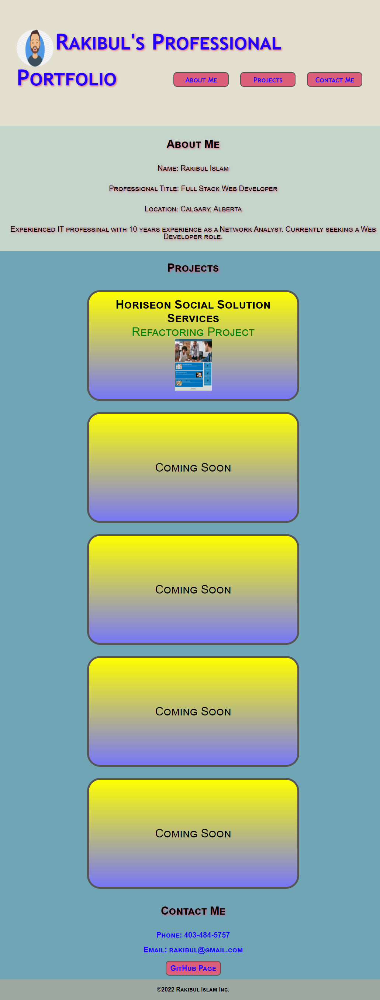

# **©Horiseon**
## Company page for ©Horiseon Social Solution Services, Inc.

### **Project Description:**
The code for this marketing agency (©Horiseon) website was refactored so that it will be easy for another developer to understand this code and make changes if required.

### **Technolgies & Acceptance Criteria:**
The ©Horiseon website uses these technologies to work properly:
- [HTML] - HyperText Markup Language.
- [CSS] - Cascading Style Sheets used as the style sheet language.

This website was improved using the the Acceptance Criteria mentioned below:
- Semantic HTML elements was used.
- Structure of the HTML elements follow a logical structure independent of styling and positioning.
- All image elements now have accessible alt attributes.
- All heading attributes fall in sequential order.
- The title element shows a concise and descriptive title.
- All website links now function correctly.
- All CSS selectors and properties were consolidated and organized to follow a semantic structure.
- CSS file is now properly commented.
- Application was deployed at live URL.
- Application loads with no errors.
- Application GitHub URL was submitted.
- GitHub repository now contains the application code.

### **Deployed website link:**
https://rakibca.github.io/horiseon.github.io

### **Credits:**
- [W3Schools](https://www.w3schools.com "W3Schools")
- [MDN Web Docs](https://developer.mozilla.org "MDN Web Docs")
- [Google](https://www.google.com "Google's Homepage")
